# Sprint Coach — Architecture

This document explains how the app is put together: the tech stack, how the pieces talk to each other, the data model, and the request flow for every meaningful interaction.

It is the companion to [`README.md`](../README.md) (which focuses on "how do I run it"). This one focuses on "how does it work and why".

---

## 1. What the app is, in one paragraph

Sprint Coach is a single-user web app that asks a sprint athlete a few questions, then uses Anthropic's Claude (via an internal LLM gateway) to generate a periodized 7-day training plan, render it in a dashboard, accept daily logs and readiness check-ins, and revise the plan when the athlete describes a change in plain English. It runs as one Next.js process with a local JSON file as the entire database. Designed as a learning project: minimal infra, but the seams are drawn so any one piece (storage, auth, model provider, event categories) can be swapped without touching the rest.

---

## 2. Tech stack

### Runtime & framework

| Layer | Choice | Why |
|---|---|---|
| Runtime | Node 20+ | Required by Next 16 |
| Framework | **Next.js 16** (App Router, RSC, Server Actions, Turbopack) | Single repo for UI + server, no separate API tier needed |
| Language | **TypeScript 6** (strict) | Type safety end-to-end including server actions |

### UI

| Layer | Choice |
|---|---|
| Styling | **Tailwind CSS v4** (CSS-first config via `@theme inline`) |
| Component primitives | Hand-rolled shadcn-style components on top of **Radix UI** (Slot, Slider, Select, Checkbox, Label, Progress, etc.) |
| Icons | **lucide-react** |
| Charts | **recharts** (line chart for training load) |
| Class composition | `class-variance-authority`, `clsx`, `tailwind-merge` (via the `cn()` helper) |

### Data & domain

| Layer | Choice |
|---|---|
| Persistence | Single JSON file at `.data/store.json` (atomic write via tmp + rename) |
| Validation | **zod** for every form / action input and for the LLM tool output |
| Dates | **date-fns** |
| Domain types | Plain TypeScript in `db/schema.ts` |

### AI

| Layer | Choice |
|---|---|
| Provider SDK | **`@anthropic-ai/sdk`** (Messages API) |
| Endpoint | Configurable via `ANTHROPIC_BASE_URL` — defaults to the internal SFDC eng-ai-model-gateway (LiteLLM proxy) |
| Default model | `claude-opus-4-7` (overridable via `ANTHROPIC_MODEL`) |
| Structured output | **Forced `tool_use`** with a `tool_choice: { type: "tool", name: "emit_weekly_plan" }` — Claude's equivalent of OpenAI's `response_format: json_schema` |
| Validation | zod parses the tool's `input` after each call, with one auto-retry on failure |

### Tooling

| Layer | Choice |
|---|---|
| Lint | ESLint 9 flat config + `typescript-eslint` |
| Build | `next build` (Turbopack) |
| Package mgr | npm |

---

## 3. System diagram

A bird's-eye view of every external actor and every internal layer.

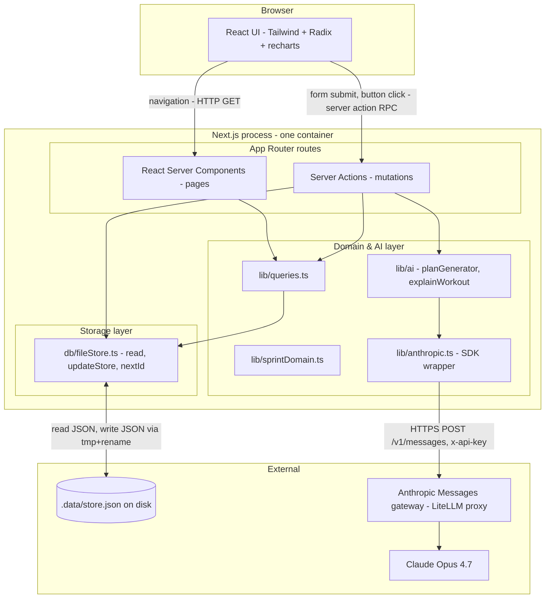

### Layered view

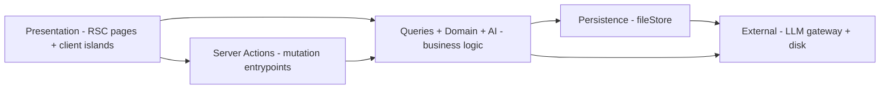

Each layer only talks down. Pages don't touch the file store directly; everything goes through `lib/queries.ts` or a server action. The file store doesn't know what entities mean; that's `db/schema.ts` + `lib/sprintDomain.ts`.

---

## 4. Directory map (what lives where)

```
project701/
├─ app/                          Next.js App Router
│  ├─ layout.tsx                 Root layout (TopNav, dark theme)
│  ├─ page.tsx                   Redirect: / -> /onboarding or /home
│  ├─ error.tsx                  Global error boundary
│  ├─ loading.tsx                Skeleton for slow RSCs
│  ├─ not-found.tsx              404
│  ├─ globals.css                Tailwind v4 import + design tokens
│  ├─ onboarding/
│  │  ├─ page.tsx                Hosts the wizard
│  │  ├─ OnboardingWizard.tsx    6-step client wizard
│  │  └─ actions.ts              completeOnboarding server action
│  ├─ home/page.tsx              Daily dashboard
│  ├─ plan/
│  │  ├─ page.tsx                Week grid + Adjust card + history
│  │  └─ [workoutId]/page.tsx    Single-workout detail
│  ├─ log/[workoutId]/
│  │  ├─ page.tsx                Quick-log RSC
│  │  └─ LogForm.tsx             Client form
│  ├─ recovery/page.tsx          Daily readiness check-in
│  ├─ progress/page.tsx          Charts + PRs + streak
│  ├─ profile/page.tsx           Profile summary
│  ├─ learn/page.tsx             Stub
│  └─ actions/
│     ├─ plan.ts                 generateWeeklyPlan + adjustWeeklyPlan
│     └─ log.ts                  saveWorkoutLog + saveReadiness
│
├─ components/
│  ├─ ui/                        shadcn-style primitives (Button, Card, Slider, ...)
│  ├─ TopNav.tsx
│  ├─ WorkoutCard.tsx
│  ├─ WeekGrid.tsx
│  ├─ ReadinessForm.tsx
│  ├─ TrainingLoadChart.tsx
│  ├─ ConsistencyHeatmap.tsx
│  ├─ GeneratePlanButton.tsx     Client - useTransition + elapsed timer
│  ├─ AdjustPlanCard.tsx         Client - free-text adjustment input
│  └─ AdjustmentHistory.tsx      RSC - timeline of past adjustments
│
├─ db/
│  ├─ schema.ts                  Plain TS types (Athlete, Workout, ...)
│  └─ fileStore.ts               JSON file persistence + write mutex
│
├─ lib/
│  ├─ athlete.ts                 getCurrentAthleteId() - the auth seam
│  ├─ anthropic.ts               Anthropic SDK client wrapper
│  ├─ queries.ts                 All read helpers (used by RSCs)
│  ├─ sprintDomain.ts            Events, season-phase, readiness scoring
│  ├─ useElapsed.ts              Client hook for "Generating... 47s"
│  ├─ utils.ts                   cn() helper
│  └─ ai/
│     ├─ schemas.ts              zod WeeklyPlanSchema (output contract)
│     ├─ planGenerator.ts        Builds prompt, calls Claude, validates
│     └─ explainWorkout.ts       Lazy "why" explanations
│
├─ .data/store.json              The entire database (gitignored)
├─ .env.local                    ANTHROPIC_API_KEY + URL + model
├─ prompts/initialPrompts.md     Original product brief
└─ docs/ARCHITECTURE.md          You are here
```

---

## 5. Data model

All entities live in [`db/schema.ts`](../db/schema.ts) as plain TypeScript types and are persisted as arrays inside one JSON object.

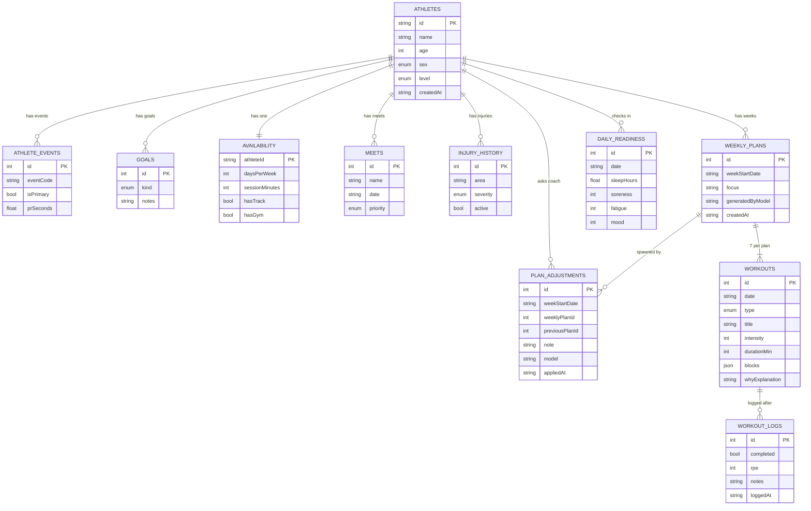

A few intentional design choices:

- **`eventCode` is a string**, not an enum, so adding `sprints_50m` or `mid_distance_800m` later doesn't require migrations.
- **`workout.blocks` is JSON**, so any event category (sprints, jumps, throws) can express its session shape without schema changes.
- **`PLAN_ADJUSTMENTS` keeps a pointer to `previousPlanId`** so an "undo" feature is one query away.
- **Single-athlete enforced in code**, not in schema — everything is keyed by `athleteId`, but `lib/athlete.ts` always returns `"me"`. Swap that function and the schema scales to multi-user.

---

## 6. Storage layer

[`db/fileStore.ts`](../db/fileStore.ts) is the entire persistence layer. About 100 lines of code.

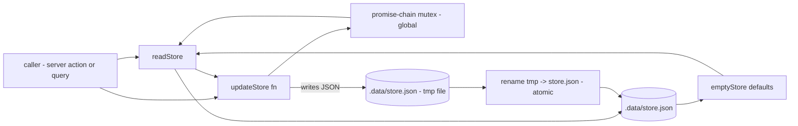

**Why each piece:**

- **No in-memory cache.** Every read hits disk. The file is small and a single user means concurrency is essentially zero, but more importantly Next.js dev hot-reload can spin up duplicate module instances, and an in-memory cache would desync them.
- **Atomic writes** (write to `*.tmp`, then `rename`) so a crash mid-write never corrupts the file.
- **Promise-chain mutex on `globalThis`** so two near-simultaneous server actions in one process can't read-modify-clobber each other.
- **Shallow-merged defaults** in `readStore()` mean we can add new collections / sequences to the schema without breaking existing `.data/store.json` files.

---

## 7. AI integration

The planner is the most interesting subsystem. It needs to produce **valid structured JSON** every time, because the rest of the app trusts those shapes.

```mermaid
flowchart TD
  start([generateWeeklyPlanFromContext ctx])
  build[Build athlete context JSON]
  prompt["Compose: SYSTEM_PROMPT (+ ADJUSTMENT addendum if revise) + user msg"]
  call[anthropic.messages.create]
  resp{Response stop_reason == tool_use?}
  parse[Find tool_use block, run WeeklyPlanSchema.safeParse]
  ok{zod ok?}
  retry["Append: 'previous response was invalid: ...' as new user turn"]
  done([Return plan])
  fail([Throw error])

  start --> build --> prompt
  prompt --> call --> resp
  resp -- yes --> parse
  resp -- no --> retry
  parse --> ok
  ok -- yes --> done
  ok -- no --> retry
  retry --> call
  retry -. "max 1 retry" .-> fail
```

### The "structured output" trick

Claude doesn't have OpenAI's `response_format: json_schema`. The closest equivalent is **forcing the model to call a specific tool**:

1. Define a single tool, `emit_weekly_plan`, whose `input_schema` is the JSON Schema for a `WeeklyPlan`.
2. Pass `tool_choice: { type: "tool", name: "emit_weekly_plan" }` — Claude is required to invoke that tool exactly once.
3. The tool's `input` field arrives already parsed as a JS object. We then run it through the zod `WeeklyPlanSchema` for belt-and-suspenders validation.
4. On schema failure we retry exactly once, appending the error message to the conversation so Claude can self-correct.

This pattern is what makes the rest of the system simple: by the time `generateWeeklyPlan` returns, every consumer can assume a valid, fully populated 7-day plan.

### Two modes: fresh vs revise

The same function powers both **first-time generation** and **adjustment**.

- **Fresh mode**: just the athlete context. System prompt = `SYSTEM_PROMPT`.
- **Revise mode**: triggered when `ctx.adjustmentNote` and `ctx.previousPlan` are both set. The user message includes the existing plan + the verbatim request. System prompt = `SYSTEM_PROMPT + ADJUSTMENT_PROMPT_ADDENDUM` ("preserve unchanged workouts, apply only what was requested, keep the date range"). Temperature drops to 0.5 in revise mode.

### The auth seam at the SDK level

[`lib/anthropic.ts`](../lib/anthropic.ts) is the only file that knows the Anthropic SDK exists. To switch model providers or add custom headers (e.g. an SFDC app-context header), edit that one file.

---

## 8. End-to-end request flows

### 8.1 Onboarding

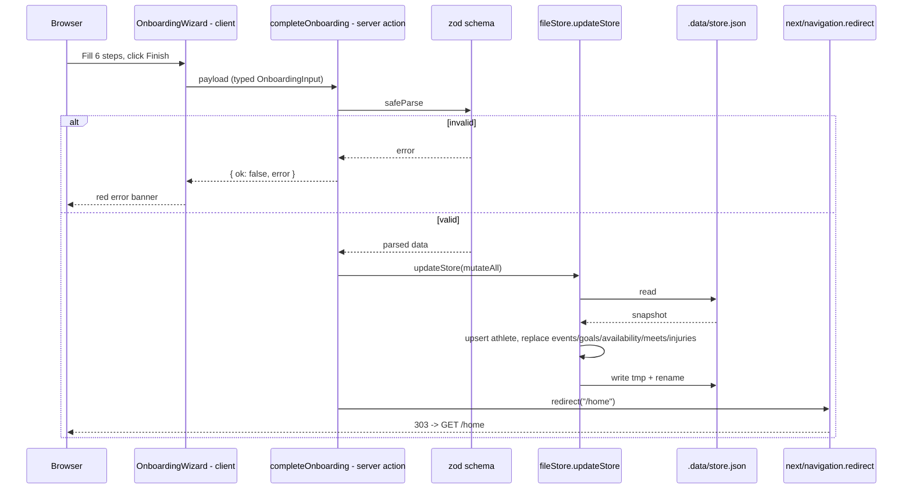

### 8.2 First weekly plan

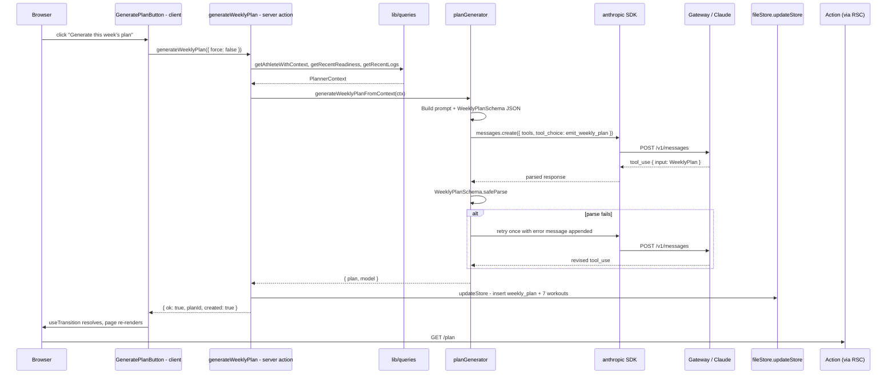

### 8.3 Adjust an existing plan (the newest feature)

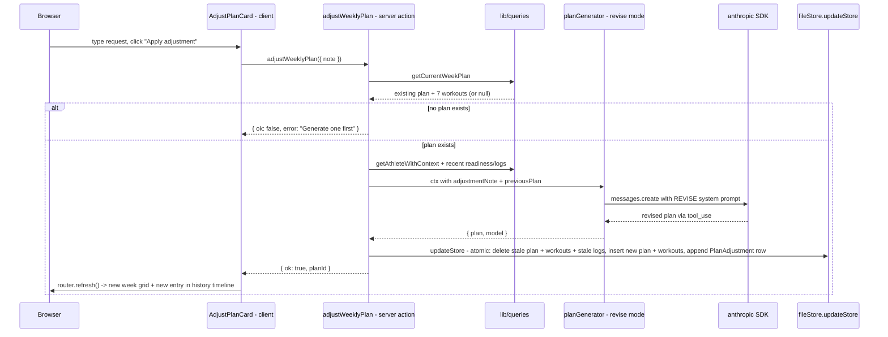

### 8.4 Daily logging

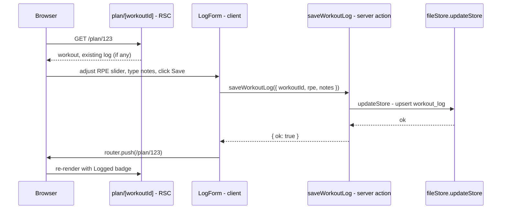

### 8.5 Recovery check-in

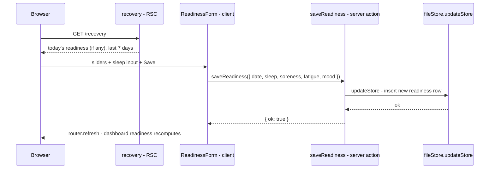

### 8.6 Reading the dashboard (`/home`)

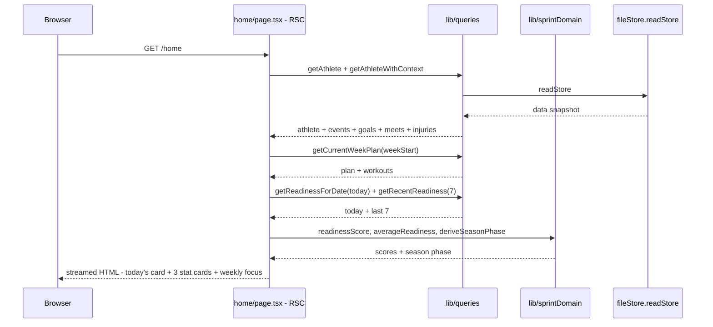

---

## 9. Frontend rendering model

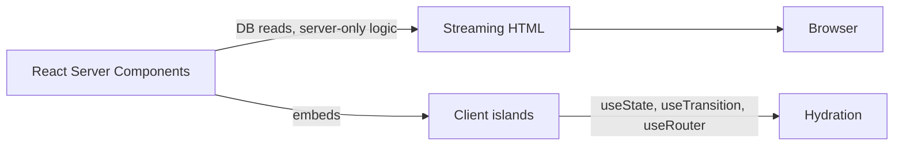

We lean heavily on RSCs:

- **Pages are server components by default.** They fetch via `lib/queries.ts` (which hits the file store) and render full HTML.
- **Client components are islands.** Just the things that need interactivity: `OnboardingWizard`, `LogForm`, `ReadinessForm`, `GeneratePlanButton`, `AdjustPlanCard`, the charts. Each marked with `"use client"`.
- **Mutations go through Server Actions.** No `/api/*` route handlers. The action is imported as a function from the client island; Next.js wires up the RPC.
- **No global client state.** Each island manages its own form state; revalidation happens via `revalidatePath()` in actions plus `router.refresh()` from clients.

---

## 10. Seams (designed for easy replacement)

| Concern | Seam | How to replace |
|---|---|---|
| Single-user assumption | [`lib/athlete.ts`](../lib/athlete.ts) | Swap `getCurrentAthleteId()` to read from your auth provider's session |
| Storage backend | [`db/fileStore.ts`](../db/fileStore.ts) | Re-implement `readStore()` and `updateStore(fn)` against Postgres / SQLite / Supabase; consumers (`lib/queries.ts` + actions) call only those two |
| Model provider | [`lib/anthropic.ts`](../lib/anthropic.ts) | Replace with an OpenAI client (and rework `planGenerator.ts` to use `response_format` instead of `tool_use`) |
| Event-specific training rules | [`lib/sprintDomain.ts`](../lib/sprintDomain.ts) + the `SYSTEM_PROMPT` in `planGenerator.ts` | Flip `supported: true` on more entries in `ALL_EVENT_CATEGORIES`, extend the system prompt with per-event coaching principles |
| Output schema for plans | [`lib/ai/schemas.ts`](../lib/ai/schemas.ts) + JSON Schema in `planGenerator.ts` | Add new fields to both; zod validates on read |

---

## 11. What's deliberately out of scope (v1)

- Authentication, accounts, multi-user
- Mobile apps (responsive web only)
- Real-time/WebSocket features
- Wearable / Strava integration
- AI chat coach (free-form Q&A — easy add: another action calling `messages.create` without tools)
- Educational content with RAG (the Learn tab is a stub)
- Notifications / reminders
- Payment / premium tier

The seams above mean each of these can be added without disturbing the rest.

---

## 12. Reading the code in order (for someone new)

If you want to build a mental model fast, read these files in this order:

1. [`db/schema.ts`](../db/schema.ts) — what data exists
2. [`db/fileStore.ts`](../db/fileStore.ts) — how it persists
3. [`lib/queries.ts`](../lib/queries.ts) — how anything reads it
4. [`lib/sprintDomain.ts`](../lib/sprintDomain.ts) — sport-specific helpers
5. [`lib/ai/schemas.ts`](../lib/ai/schemas.ts) → [`lib/ai/planGenerator.ts`](../lib/ai/planGenerator.ts) → [`lib/anthropic.ts`](../lib/anthropic.ts) — the AI pipeline
6. [`app/actions/plan.ts`](../app/actions/plan.ts) and [`app/actions/log.ts`](../app/actions/log.ts) — every mutation
7. [`app/home/page.tsx`](../app/home/page.tsx) — a representative RSC
8. [`app/plan/page.tsx`](../app/plan/page.tsx) — the most feature-dense page (week grid + generate + adjust + history)
9. [`components/AdjustPlanCard.tsx`](../components/AdjustPlanCard.tsx) — a representative client island calling a server action with `useTransition`

That's the whole shape of the app.
